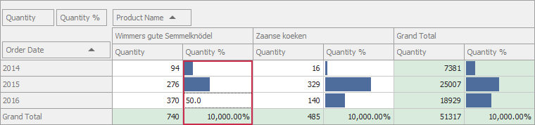

<!-- default badges list -->

<!-- default badges end -->

# Pivot Grid for WinForms - Override the In-Place Cell Editor 

This example shows how to change the editor type when the editor is in "edit" mode. 

The `ProgressBar` in-place editor (repository item) displays values of the "Quantity %" field as progress bars. In "edit" mode, the [CustomCellEditForEditing](https://docs.devexpress.com/WindowsForms/DevExpress.XtraPivotGrid.PivotGridControl.CustomCellEditForEditing) event is raised to change this repository item to `TextEdit`.

## Files to Review
* [Form1.cs](./CS/PivotGridControl_CustomCellEdit/Form1.cs) (VB: [Form1.vb](./VB/PivotGridControl_CustomCellEdit/Form1.vb))

## Documentation

[Assigning Editors for In-place Editing](https://docs.devexpress.com/WindowsForms/5896/controls-and-libraries/pivot-grid/data-shaping/editing/assigning-editors-for-in-place-editing)

## More Examples 

- [Pivot Grid for WinForms - Assign In-Place Editors to Different Types of Cells](https://github.com/DevExpress-Examples/winforms-pivotgrid-assign-in-place-editors-to-different-types-of-cells)
- [Pivot Grid for WinForms - Edit Pivot Grid Cells in the UI and Store Cell Values in the Underlying Data Source](https://github.com/DevExpress-Examples/winforms-pivotgrid-how-to-edit-and-save-cell-values)
<!-- feedback -->
## Does this example address your development requirements/objectives?

 

(you will be redirected to DevExpress.com to submit your response)
<!-- feedback end -->
